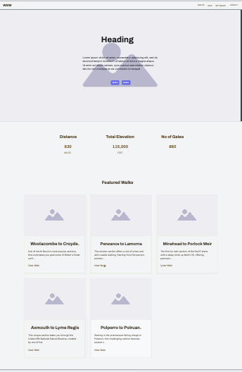
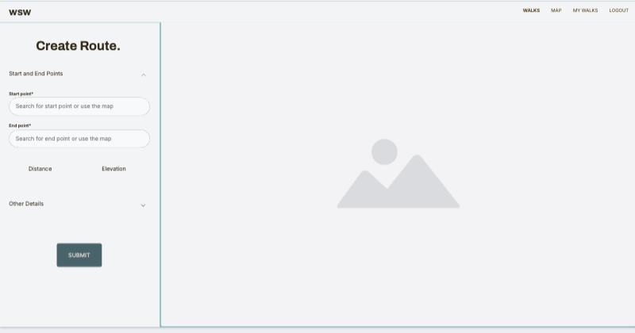
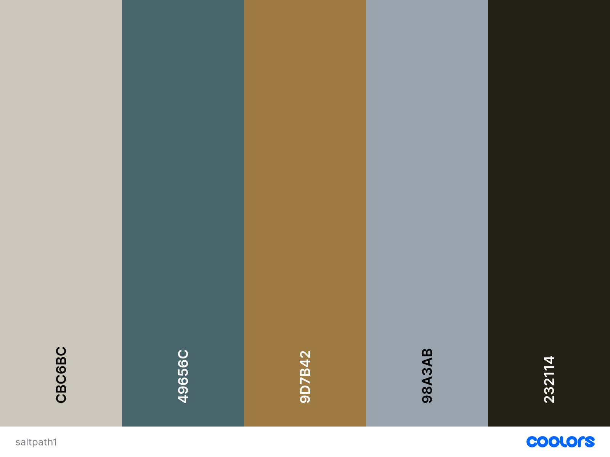
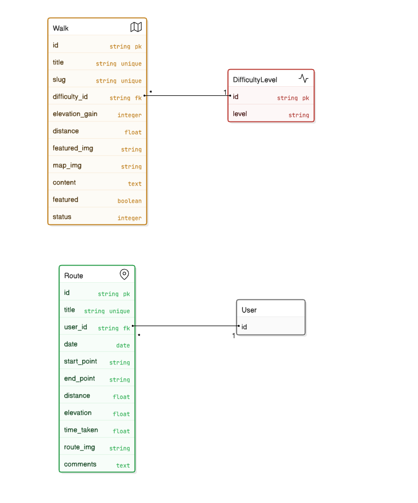
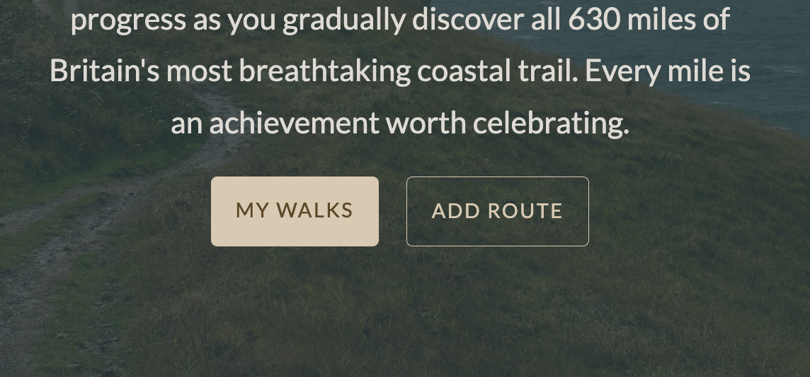
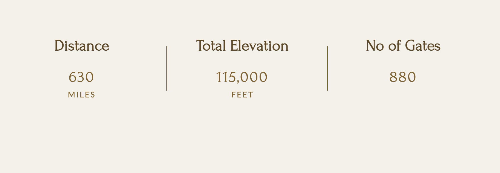
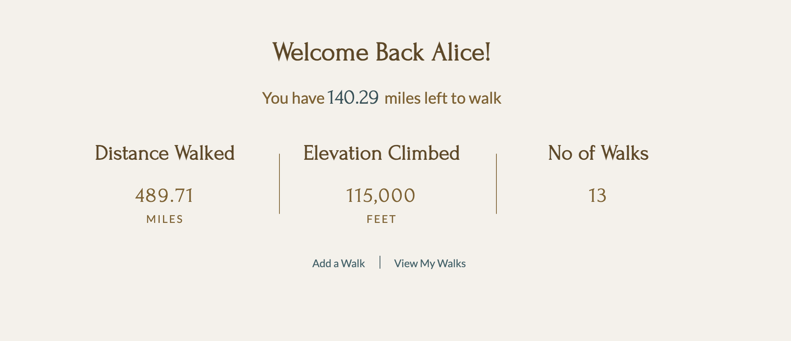
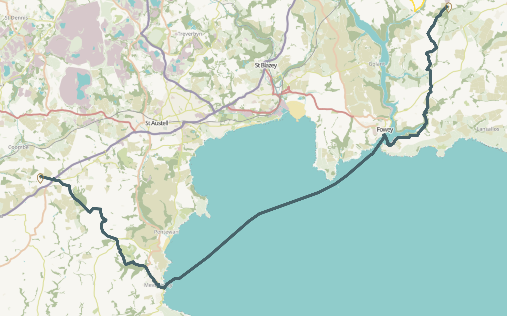

# Walk South West

## Overview

An app to keep track of how much of the South West coastal path the user has walked.

### User Stories

- [Trello Kanban Board](https://trello.com/invite/b/6745eaca0a76ea45ef8826d6/ATTId728c7a61a787b417503eafe40cf68feC19FDF22/wsw)

  
User Authentication

1. **Create Account:** As a user, I want to create an account, so that I can save my progress and access it from different devices.
2. **Secure Login:** As a user, I want to log in securely, so that only I can view and update my progress.
3. **Password Reset:** As a user, I want to reset my password, so that I can regain access if I forget it.

  
Tracking Walked Sections

4. **Mark Sections:** As a user, I want to mark sections of the South West Coastal Path that I have walked, so that I can track my progress.
5. **Update Sections:** As a user, I want to update sections I’ve walked previously, so that I can correct or refine my records.
6. **Nearby Suggestions:** As a user, I want the app to suggest nearby sections based on my current location, so that I can plan my walks more easily.

  
Visualizing Progress

7. **Map Highlighting:** As a user, I want to see a map highlighting the sections of the path I have walked, so that I have a visual reminder of my journey.
8. **Color Coding:** As a user, I want the map to display different colors for completed and uncompleted sections, so that I can quickly identify my progress.
9. **Map Zoom:** As a user, I want to zoom in and out on the map, so that I can view specific sections in detail or the entire path at a glance.

  
Statistics and Progress

10. **Completion Percentage:** As a user, I want to see the percentage of the path I have completed, so that I can track my overall progress.
11. **Distance Tracking:** As a user, I want to see the total distance I’ve walked and the remaining distance, so that I can plan future walks.
12. **Progress Over Time:** As a user, I want to view my progress over time (e.g., by month or year), so that I can reflect on my walking habits.

  
Admin Features

13. **Add Walks:** As an Admin, I want to add walks to the website.
14. **Featured Walks:** As an admin, I want to mark some walks as featured.

## UX Design Process

  
Wireframes

- 
- 

**Design Rationale:**

#### Colour Pallete

The inital colour scheme from an image of the SoutWest coastal path using [coolors.co](https://coolors.co/e84610-009fe3-4a4a4f-445261-d63649-e6ecf0-000000) to generate my colour palette:

Tints and shades generated using a [generator](https://maketintsandshades.com/)

It became apparent that an accent/complemetory colour was necessary that would stand out for some elements - I choose a yellow to reflect the gorse that grows along the path (#ffd60a)

#### Typography

Fonts are from google and hosted locally for performance gains;

- Headings/accent - [Forum](https://fonts.google.com/specimen/Forum) a classic serif font

- Base text - [Lato](https://fonts.google.com/specimen/Lato) a text that is easy to read and

I used [FontSquirrel](https://www.fontsquirrel.com/) to convert to web fonts.

## Database Schema

## Key Features

### Track Walked Parts of the South West Coastal Path

- User can add their route to the map
- User can search for their start/end points via form search box
- User can add comments/images related to their route
- User can view a table of all walks or a visual representation on a map.
- User can edit or delete all walks that they have added

### Admin can add walks to website

- Superusers can add walks via the site admin page that will be disaplayed on the [website](https://walk-south-west-50fc52fd9c8d.herokuapp.com/walks/)
- Walks can be marked as featured to be displayed on home page

### Authenticated Users

Navigation

Logged in users can access the map and my-walks pages via navigation. Un registered/logged out users can log in or register

Home page hero

Logged in users see buttons to view their walks, unregistered/logged out users see buttons to sign in or register

Stats section

Logged in users can see stats relating to the SWCP. Unregistered/logged out users see stats relating to their walking activity

## Maps

To integate maps into the app I used [leaflet](https://leafletjs.com/). In order to draw a polyline on the map that traced an actual walking path I needed another layer.

#### GeoJSON

I attempted to use a geojson file of the coastal path found on the plymouth city council [website](https://www.data.gov.uk/dataset/105a4ca6-9b83-42c7-8c08-f0f1a21dec00/south-west-coast-path). However I struggled to get it to work and after investigation relaised taht it uses a coordinate reference system (CRS) that is not the default WGS84 (latitude, longitude) used by Leaflet. The CRS in this file is EPSG:27700, which is the British National Grid.

While it should be possible to convert the data my inital attempts were unsuccessful. This is something I would like to return to.

#### ORS

As an alternative I used the open route service [API](https://openrouteservice.org/).

This combined with the L.Routing.control function from leaflet-routing-machine allowed me to display the route on the map and draw a path between one point and another.

## Technologies Used

### Languages

- [HTML](https://developer.mozilla.org/en-US/docs/Web/HTML)
- [CSS](https://developer.mozilla.org/en-US/docs/Web/CSS)
- [JavaScript](https://developer.mozilla.org/en-US/docs/Web/JavaScript)
- [Sass/Scss](https://sass-lang.com/)
- [Python](https://www.python.org/)

### Frameworks and Libraries

- [Django](https://www.djangoproject.com/)

## Deployment

- **Platform:** Heroku
- **High-Level Deployment Steps:**
  1. Add a requirements.txt file listing all Python dependencies
  2. Create a Procfile specifying how to run the application
  3. Make sure your application is configured to use environment variables for sensitive information
- **Verification and Validation:**
  - Manually test all critical application routes and features after deployment
  - Check application logs with heroku logs --tail for any deployment or runtime errors
- **Security Measures:**
  - Use of environment variables for sensitive data.
  - Ensured DEBUG mode is disabled in production.

## AI Implementation and Orchestration

### Use Cases and Reflections:

(Highlight how prompts, such as reverse, question-and-answer or multi-step, were used to support learners with SEND or ALN where relevant.)

- **Aministration/Repetitive tasks:**
- Reflection: Strategic use of AI allowed me to perform admin tasks quicky and efficiently
- Examples: I used AI to assist with creation of user stories and then to convert them to a CSV file. AI assisted with writing a python script using Trello's Rest API that created a populated a trello card with description and checklist for each user story
- **Code Creation:**
  - Reflection: Strategic use of AI allowed for rapid prototyping, with minor adjustments for alignment with project goals.
  - Examples: Reverse prompts for alternative code solutions and question-answer prompts for resolving specific challenges.
- **Debugging:**
  - Reflection: Key interventions included resolving logic errors and enhancing maintainability, with a focus on simplifying complex logic to make it accessible.
- **Performance and UX Optimization:**
  - Reflection: Minimal manual adjustments were needed to apply AI-driven improvements, which enhanced application speed and user experience for all users.
- **Automated Unit Testing:**

  - Reflection: Adjustments were made to improve test coverage and ensure alignment with functionality. Prompts were used to generate inclusive test cases that considered edge cases for accessibility.

- **Overall Impact:**
  - AI tools streamlined repetitive tasks, enabling focus on high-level development.
  - Efficiency gains included faster debugging, comprehensive testing, and improved code quality.
  - Challenges included contextual adjustments to AI-generated outputs, which were resolved effectively, enhancing inclusivity.

## Testing Summary

- **Manual Testing:**
  - **Devices and Browsers Tested:** [List devices and browsers, ensuring testing was conducted with assistive technologies such as screen readers or keyboard-only navigation.]
  - **Features Tested:** [Summarise features tested manually, e.g., CRUD operations, navigation.]
  - **Results:** [Summarise testing results, e.g., "All critical features worked as expected, including accessibility checks."]
- **Automated Testing:**
  - Tools Used: [Mention any testing frameworks or tools, e.g., Django TestCase.]
  - Features Covered: [Briefly list features covered by automated tests.]
  - Adjustments Made: [Describe any manual corrections to AI-generated test cases, particularly for accessibility.]

## Future Enhancements

- Work on map routing as mentioned earlier - route isn't always in line with the actual SWCP and ocassionaly will take an _unconventional_ route (i.e. through the sea)

- Ability to drag paths from all points not just start and end points
- Ability to navigate using map and save a route that way.
- Ability to see recommended walks based on location
- Ability to filter walks based on difficulty level
