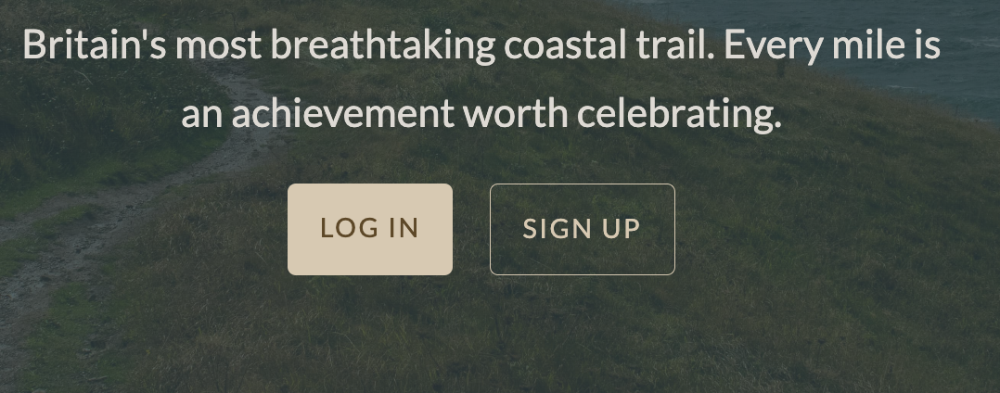
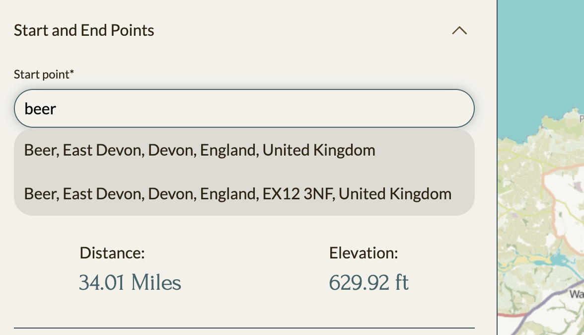
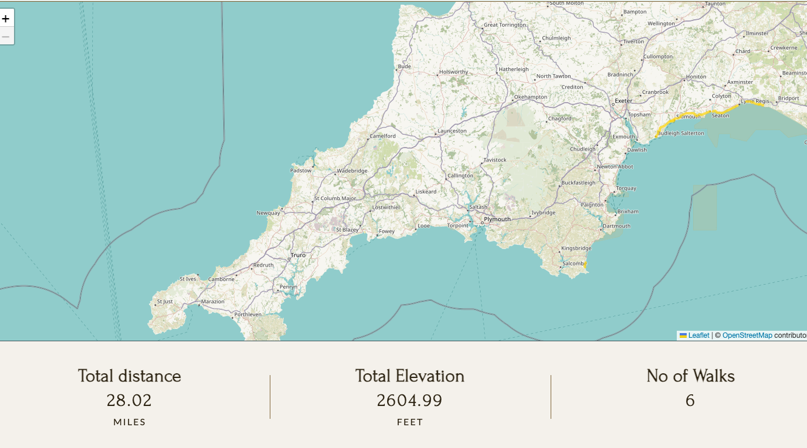

# Walk South West

## Table of Contents

- [Overview](#overview)
- [Project Management](#project-management)
- [User Stories](#user-stories)
- [UX Design Process](#ux-design-process)
- [Database Schema](#database-schema)
- [Key Features](#key-features)
  - [Track Walked Parts of the South West Coastal Path](#track-walked-parts-of-the-south-west-coastal-path)
  - [Admin can add walks to website](#admin-can-add-walks-to-website)
  - [Authenticated Users](#authenticated-users)
- [Maps](#maps)
  - [GeoJSON](#geojson)
  - [ORS](#ors)
- [Technologies Used](#technologies-used)
  - [Languages](#languages)
  - [Frameworks and Libraries](#frameworks-and-libraries)
- [Deployment](#deployment)
- [AI Implementation and Orchestration](#ai-implementation-and-orchestration)
- [Testing Summary](#testing-summary)
- [Future Enhancements](#future-enhancements)
- [Bugs](#bugs)

## Overview

An app to keep track of how much of the South West coastal path the user has walked.

### Project Management

- [Trello Kanban Board](https://trello.com/invite/b/6745eaca0a76ea45ef8826d6/ATTId728c7a61a787b417503eafe40cf68feC19FDF22/wsw)

In this project, I used the MoSCoW prioritization method to categorize and prioritize the features and requirements. MoSCoW stands for Must have, Should have, Could have, and Won't have. This method helps in managing the scope of the project by clearly defining the priority of each feature. Here is a brief description of each label:

- **Must have:**

These are the critical features that are essential for the project to be successful. Without these features, the project would be considered incomplete or a failure. They are non-negotiable and must be included in the final product.

- **Should have:**

These features are important but not critical. They add significant value to the project and should be included if possible. However, the project can still be considered successful without them.

- **Could have:**

These are desirable features that could enhance the project but are not essential. They are often considered as nice-to-have features and can be included if time and resources permit.

- **Won't have:**

These features are agreed to be out of scope for the current project. They might be considered for future releases but are not included in the current development cycle

### User Stories

  
User Authentication

1. **Create Account:** As a user, I want to create an account, so that I can save my progress and access it from different devices.
2. **Secure Login:** As a user, I want to log in securely, so that only I can view and update my progress.
3. **Password Reset:** As a user, I want to reset my password, so that I can regain access if I forget it.

  
Tracking Walked Sections

4. **Mark Sections:** As a user, I want to mark sections of the South West Coastal Path that I have walked, so that I can track my progress.
5. **Update Sections:** As a user, I want to update sections I’ve walked previously, so that I can correct or refine my records.
6. **Nearby Suggestions:** As a user, I want the app to suggest nearby sections based on my current location, so that I can plan my walks more easily.

  
Visualizing Progress

7. **Map Highlighting:** As a user, I want to see a map highlighting the sections of the path I have walked, so that I have a visual reminder of my journey.
8. **Color Coding:** As a user, I want the map to display different colors for completed and uncompleted sections, so that I can quickly identify my progress.
9. **Map Zoom:** As a user, I want to zoom in and out on the map, so that I can view specific sections in detail or the entire path at a glance.

  
Statistics and Progress

10. **Completion Percentage:** As a user, I want to see the percentage of the path I have completed, so that I can track my overall progress.
11. **Distance Tracking:** As a user, I want to see the total distance I’ve walked and the remaining distance, so that I can plan future walks.
12. **Progress Over Time:** As a user, I want to view my progress over time (e.g., by month or year), so that I can reflect on my walking habits.

  
Admin Features

13. **Add Walks:** As an Admin, I want to add walks to the website.
14. **Featured Walks:** As an admin, I want to mark some walks as featured.

## UX Design Process

  
Wireframes

- 
- 

**Design Rationale:**

I designed the site to be clean and minimal with a clear user journey.

#### Colour Pallete

The inital colour scheme from an image of the SoutWest coastal path using [coolors.co](https://coolors.co/e84610-009fe3-4a4a4f-445261-d63649-e6ecf0-000000) to generate my colour palette:

Tints and shades generated using a [generator](https://maketintsandshades.com/)

It became apparent that an accent/complemetory colour was necessary that would stand out for some elements - I choose a yellow to reflect the gorse that grows along the path (#ffd60a)

#### Typography

Fonts are from google and hosted locally for performance gains;

- Headings/accent - [Forum](https://fonts.google.com/specimen/Forum) a classic serif font

- Base text - [Lato](https://fonts.google.com/specimen/Lato) a text that is easy to read and

I used [FontSquirrel](https://www.fontsquirrel.com/) to convert to web fonts.

## Database Schema

## Key Features

### Track Walked Parts of the South West Coastal Path

- User can add their route to the map
- User can search for their start/end points via form search box
- User can add comments/images related to their route
- User can view a table of all walks or a visual representation on a map.
- User can edit or delete all walks that they have added

### Admin can add walks to website

- Superusers can add walks via the site admin page that will be disaplayed on the [website](https://walk-south-west-50fc52fd9c8d.herokuapp.com/walks/)
- Walks can be marked as featured to be displayed on home page

### Authenticated Users

Navigation

Logged in users can access the map and my-walks pages via navigation. Un registered/logged out users can log in or register

Home page hero

Logged in users see buttons to view their walks, unregistered/logged out users see buttons to sign in or register

Stats section

Logged in users can see stats relating to the SWCP. Unregistered/logged out users see stats relating to their walking activity

### Add a walk to a map

Users can use a map or search via the form to add their walks. Typing in 3 letters will bring up Leaflet geocode suggestions which will convert to coordinates.

The markers are draggable and can be changed. Currently they are only draggable at the start and end points, dragging from any part of the polyline is a feature I would like to add.

### Keep track of walked parts of SWCP

Users can see a list of all the routes they have entered and edit/delete them

Users can also see a visual representation of how much of the path they have walked on a map(marked in yellow)

## Maps

To integate maps into the app I used [leaflet](https://leafletjs.com/). In order to draw a polyline on the map that traced an actual walking path I needed another layer.

#### GeoJSON

I attempted to use a geojson file of the coastal path found on the plymouth city council [website](https://www.data.gov.uk/dataset/105a4ca6-9b83-42c7-8c08-f0f1a21dec00/south-west-coast-path). However, I encountered difficulties getting it to work. Upon investigation, I realised that the file uses a coordinate reference system (CRS) different from the default WGS84 (latitude, longitude) used by Leaflet. The CRS in this file is EPSG:27700, which corresponds to the British National Grid.

While it should be possible to convert the data my inital attempts were unsuccessful. This is something I would like to return to.

#### ORS

As an alternative I used the open route service [API](https://openrouteservice.org/).

This combined with the L.Routing.control function from leaflet-routing-machine allowed me to display the route on the map and draw a path between one point and another.

## Technologies Used

### Languages

- [HTML](https://developer.mozilla.org/en-US/docs/Web/HTML)
- [CSS](https://developer.mozilla.org/en-US/docs/Web/CSS)
- [JavaScript](https://developer.mozilla.org/en-US/docs/Web/JavaScript)
- [Sass/Scss](https://sass-lang.com/)
- [Python](https://www.python.org/)

### Frameworks and Libraries

- [Django](https://www.djangoproject.com/)

## Deployment

- **Platform:** Heroku
- **High-Level Deployment Steps:**
  1. Add a requirements.txt file listing all Python dependencies
  2. Create a Procfile specifying how to run the application
  3. Make sure application is configured to use environment variables for sensitive information
- **Verification and Validation:**
  - Manually test all critical application routes and features after deployment
  - Check application logs with heroku logs --tail for any deployment or runtime errors
- **Security Measures:**
  - Use of environment variables for sensitive data.
  - Ensured DEBUG mode is disabled in production.

## AI Implementation and Orchestration

### Use Cases and Reflections:

- **Aministration/Repetitive tasks:**
- Reflection: Strategic use of AI allowed me to perform admin tasks quicky and efficiently
- Examples: I used AI to assist with creation of user stories and then to convert them to a CSV file. AI assisted with writing a python script using Trello's Rest API that created a populated a trello card with description and checklist for each user story
- **Code Creation:**
  - Reflection: Strategic use of AI allowed for rapid prototyping, with minor adjustments for alignment with project goals.
  - Examples: Reverse prompts for alternative code solutions and question-answer prompts for resolving specific challenges.
- **Debugging:**
  - Reflection: I ran all error messages through copilot in order to solve them.
  - Used extensively for javascript debugging but had to check the code carefully as some other feature would often break as a result of the intevention
- **Performance and UX Optimization:**

  - Used AI to bulk add attributes to images (ie lezy loading)

- **Testing:**

  - AI Allowed me to easily and quickly write test for forms and views. While it sometimes used the wrong model within the test it still saved ma huge amount of time and deepend my understanding of Django testing.

- **Overall Impact:**
  - AI tools streamlined repetitive tasks, enabling focus on high-level development.
  - Efficiency gains included faster debugging, comprehensive testing, and improved code quality.
  - Challenges included contextual adjustments to AI-generated outputs, which were resolved effectively, enhancing inclusivity.

## Testing Summary

- **Manual Testing:**
  - **Devices and Browsers Tested:** Chrome, Safari and Firefox. Css was edited for safari as some modern css does not work.
  - **Features Tested:** Crud functionality (view, edit and delete walks), drawing route on map and editing start and end points.
  - **Results:** Most critical features work as expected - thse that don't are listed under bugs
- **Automated Testing:**
  - Tools Used: Django Testcases of forms and views
  - Features Covered: Forms, get and post requests

## Future Enhancements

- Work on map routing as mentioned earlier - route isn't always in line with the actual SWCP and ocassionaly will take an _unconventional_ route (i.e. through the sea)

- Ability to drag paths from all points not just start and end points
- Ability to live navigate using map and save a route that way.
- Ability to see recommended walks based on location
- Ability to filter walks based on difficulty level
- Add geodjango so maps can be created for both admin (Walks) and user (routes) detail pages
- Allow multiple image uploads to clouidnary via user form
- User profile page and avatar
- Ability for user to comment on admin added walks
- Custom 404 page
- Instructions for the user on using the map
- Improve perfomance
- Log in using google

## Bugs

- Map loading - first route brings up an 'error fetching route' message. On refresh everything is fine
- Leaflet geocoder suggestions are very slow, taking up to 10 seconds to show suggestions
- Uploading images in edit view results in cloudinary errors
